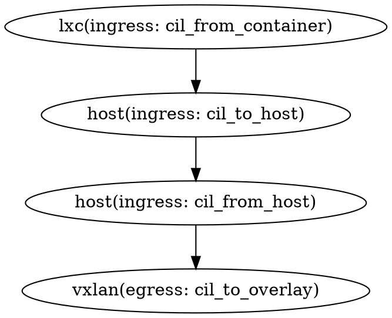

# next steps

* I was able to see SKB_DROP_REASON_TC_INGRESS while using pwru in the proxy pod
* It seesm to get to the lxc interface with the reply and drop it there
* CPU 05: MARK 0x0 FROM 2657 DROP: 98 bytes, reason Invalid source ip, identity 21435->unknown (DROP_INVALID_SIP)
   ^^ cilium monitor -vv -t drop

# IPAM

ipam_api_handler.go
	Is the REST API
	does an r.IPAM.AllocateNextWithExpiration
	kubectl logs -n kube-system -l k8s-app=cilium --tail=100 -f | grep "=="
ipam_api_handler.go: 68 goes from pool that seems like the gateway is likely just null at this point. Verified it is with Debug printing at 52


all done in go apparently
in pkg/ipam/node_manager.go

pkg/ipam/types.go (AllocationResult#GatewayIP)
cilium-agent --debug 2>&1 | grep "==>"

crd allocator has the allocators for the clouds for some reason

node_config.h is written to the filesystem and contains some #defines (one of which is the gateway IP)
    cilium.v4.internal.str = cilium_host's IP

netlink.go#setupBaseDevice sets up the veth pair?


pkg/client/ipam.go#IPAMAllocate
plugins/cilium-cni/cmd/cmd.go#Add
plugins/cilium-cni/cmd/cmd.go#configureIface
plugins/cilium-cni/cmd/cmd.go#addIPConfigToLink
plugins/cilium-cni/cmd/cmd.go#prepareIP (HostAddr is populated at this point)

Because the prepareIP is populated, where does it get populated
** PrepareEndpoint


### unexplored
====> look at address.go:GetNodeAddressing
LocalNodeConfiguration has a CiliumInternalIPv4 which is IP assigned to cilium_host
HostDevice // which = cilium_host
GetCiliumInternalIP
node_addressing.go:Router() returns the IP
internalIPv4() in reconciler.go seems to return the GW ip too
maybe on the cilium_host (cil_to_host, i should just redirect to the interface directly?)

whaaaat?
```
If k8s.Init() failed to retrieve the IPv4AllocPrefix we can try to derive
it from an existing node_config.h file or from previous cilium_host
interfaces.
```

```
// ExtractCiliumHostIPFromFS returns the Cilium IPv4 gateway and router IPv6 address from
// the node_config.h file if is present; or by deriving it from
// defaults.HostDevice interface, on which only the IPv4 is possible to derive.
```

# ebpf

The bpf_overlay:422 has the enable egress_gateway_common flag

* handle_nat_fwd() handles revDNAT, fib_lookup_redirect, and bpf_snat for
* nodeport. If revdnat_only is set to true, fib_lookup and bpf_snat are
* skipped.

ENABLE_SKIP_FIB

i've hit a wall trying to rewrite the MAC here. sees the kernel is still rewriting it
maybe more pwru??

?? maybe tailcall the rewrite program??

tail_handle_ipv4_cont

its ugly, but there is a lot of the CT tracking here
#define TAIL_CT_LOOKUP4(ID, NAME, DIR, CONDITION, TARGET_ID, TARGET_NAME)	\

// cilium by default uses 'THIS_INTERFACE_MAC (cilium_host i think) as the "router"
// we are solving this with our IPAM hacks
union macaddr router_mac = THIS_INTERFACE_MAC;

starts with cil_from_container
getting printk hits inside established portion of handle_ipv4_from_lxc

# see list of macs & interface ids (and ips)

cilium bpf endpoint list

__lb4_lookup_backend
struct lb4_backend

lb4_xlate(struct // seems to be where the rewrite is
^ that is called from lb4_local

lb.h:1748 then does the localredirect(svc)

bpftool prog tracelog

sequence

- look for CT
- if nothing, lb4_select_backend_id
   lb4_lookup_backend()
- create a CT entry

===

ENABLE_LOCAL_REDIRECT_POLICY
SVC_FLAG_LOCALREDIRECT
lb4_svc_is_localredirect

#if !defined(DISABLE_LOOPBACK_LB) ||  
(defined(ENABLE_LOCAL_REDIRECT_POLICY) && defined(HAVE_NETNS_COOKIE))
if (saddr == backend->address) {
#if defined(ENABLE_LOCAL_REDIRECT_POLICY) && defined(HAVE_NETNS_COOKIE)
if (netns_cookie > 0 && unlikely(lb4_svc_is_localredirect(svc)) &&
lb4_skip_xlate_from_ctx_to_svc(netns_cookie, tuple->daddr, tuple->sport))
return CTX_ACT_OK;
#endif /* ENABLE_LOCAL_REDIRECT_POLICY && HAVE_NETNS_COOKIE */

#ifdef ENABLE_LOCAL_REDIRECT_POLICY
if (lb4_svc_is_localredirect(svc) &&
lb4_skip_xlate_from_ctx_to_svc(get_netns_cookie(ctx_full),
orig_key.address, orig_key.dport))
return -ENXIO;
#endif /* ENABLE_LOCAL_REDIRECT_POLICY */

lb.h(1584)
/* Service translation logic for a local-redirect service can cause packets to

* be looped back to a service node-local backend after translation. This can
* happen when the node-local backend itself tries to connect to the service
* frontend for which it acts as a backend. There are cases where this can break
* traffic flow if the backend needs to forward the redirected traffic to the
* actual service frontend. Hence, allow service translation for pod traffic
* getting redirected to backend (across network namespaces), but skip service
* translation for backend to itself or another service backend within the same
* namespace. Currently only v4 and v4-in-v6, but no plain v6 is supported.
* * For example, in EKS cluster, a local-redirect service exists with the AWS

* metadata IP, port as the frontend <169.254.169.254, 80> and kiam proxy as a
* backend Pod. When traffic destined to the frontend originates from the kiam
* Pod in namespace ns1 (host ns when the kiam proxy Pod is deployed in
* hostNetwork mode or regular Pod ns) and the Pod is selected as a backend, the
* traffic would get looped back to the proxy Pod.
   */

## VXLAN/encapsulation

### Facts

* The encapsulation and redirect comes from the lxc interface in handle_ipv4_from_lxc (encap_and_redirect_lxc)
* The bpf tunnel key is actually set in ctx_set_encap_info
* The remote ip is `bpf_ntohl(tunnel_endpoint) -> node_id -> remote_ipv4`
* The VNI of the packet will include (<<8) the source security id
* The ipcache map (`cilium bpf ipcache list`) houses the endpoint tunnel id for the pod

   * identity becomes info (from ipcache lookup) at bpf_overlay.c:383

* The endpoint map are per node, so we can't lookup endpoints on remote nodes
* When you do a redirect from a ebpf call, you go to the egress and not the ingress program
   * so when we go from vxlan -> net (egress) -> host (egress)

???
?
? Picking this up after a month or so, i docker stopped node 2 and i saw TO overlay2.8  from cil_to_overlay which says it is attached to
? the egress of the tunnel. so maybe i'm misunderstanding what i was saying here
?
??* We proved that he flow goes vxlan ingress(local) -> vxlan egress(remote) -> vxlan ingress(remote) -> vxlan egress(local)
??
??   * this was by doing a drop in the l3_local_delivery egress function but doing a cilium vxlan tcpdump on remote. A ping from the local was seen in packet capture on the remote node, so we know that the egress wasn't hit on the vxlan egress(local) side before that. it would have been dropped

TODOs

* Trace cil_from_container more
* I think i need to embed the correct MAC this time, and leave it untouched through the interface
* I want to try to use the tunnel_flags or tunnel_ext to indicate to untouch the flags on the far side. That is, if i can avoid looking up the mac again on the far side

### Notes

bpf_overlay:459 explains some of what happens when a packet coming to the node from the tunnel if the IP doesnt match an endpoint. they assume it is going to the local host
return ipv4_host_delivery(ctx, ip4)
BUT i think that sets the MAC of the host mac

## Runs

# note: because they on the same kernel, the 2 nodes/pods interleave here

```sh
ping-365811  [001] bNs2. 148054.288824: bpf_trace_printk: TO overlay2.2
ping-365811  [001] bNs2. 148054.288828: bpf_trace_printk: setting src_sec_identity
ping-365811  [001] bNs2. 148054.288828: bpf_trace_printk: src_sec_id: 18270  <= src id
ping-365811  [001] bNs2. 148054.288828: bpf_trace_printk: cil_to_overlay ret
ping-365811  [001] .Ns2. 148054.288888: bpf_trace_printk: from overlay
ping-365811  [001] bNs2. 148054.288915: bpf_trace_printk: TO overlay2.2
ping-365811  [001] bNs2. 148054.288915: bpf_trace_printk: setting src_sec_identity
ping-365811  [001] bNs2. 148054.288915: bpf_trace_printk: src_sec_id: 14348  <= remote id
ping-365811  [001] bNs2. 148054.288915: bpf_trace_printk: cil_to_overlay ret
ping-365811  [001] .Ns2. 148054.288935: bpf_trace_printk: from overlay
```

[vxlan, local side]
[vxlan, remote side]
[[egress]]
ipv4_local_delivery
router_mac = node_mac of REMOTE/target lxc device
lxc_mac    = far-roxy pod MAC

TODO

i think it runs through the cil_to_

```sh
make kind-image-fast
```

```sh
# way to dump all of the bpf maps at once
cilium bpf l | grep "Available Commands" -A 21 | grep -v Avail | awk '{print $1}' | xargs -I{} bash -c "echo '===={}=====' && cilium bpf {} list"
```


Convert or encode/decode ips to uint

```
python3 script_ip_tool.py encode 1.0.168.192
```


I can use this to roughly figure out what node the ebpf program is running on

```
cilium bpf endpoint list // will only have some ips 

printk("lookup test: 03 (node 1): %p", __lookup_ip4_endpoint(67114156));
printk("lookup test: 04 (node 2): %p", __lookup_ip4_endpoint(50336940));
```


===
=== old notes
===

### modifying routes for container

on host
> crictl ps
> crictl inspect <container_id>
> nsenter -n -t <net_ns>

### cilium host

https://www.youtube.com/watch?v=0BKU6avwS98 (22:40)
if we forward the traffic, it goes to cilium_host
--> then it goes to host's root ns routing



### Useful commands

```sh
# in kind-worker{n}
> cilium enpoint list

# Show vxlan info
ip -d link show vxlan0

bpftool net list dev cilium_vxlan
bpftool net

# remove from eth0 may be necessary to get it to reload?
bpftool link detach id {link_id of the bpftool net command}
```
https://developers.redhat.com/blog/2018/10/22/introduction-to-linux-interfaces-for-virtual-networking#vxlan
https://www.kernel.org/doc/Documentation/networking/vxlan.txt
https://vincent.bernat.ch/en/blog/2017-vxlan-linux


```sh
# get the veth MAC pair for a workload
# on cilium agent
> cilium map get cilium_lxc
cilium bpf endpoint list
```

```sh
> tc filter list dev cilium_vxlan ingress
> bpftool prog show
```

```
bpftrace -e 'kprobe:ip_rcv { printf("mark: 0x%08x\n", ((struct sk_buff *)arg0)->mark); }'
bpftrace -e 'tracepoint:xdp:xdp_exception {printf("oof\n");}'
```

### References

https://www.youtube.com/watch?v=0BKU6avwS98
https://www.youtube.com/watch?v=Ocy2pFhNFfE

https://docs.cilium.io/en/stable/network/ebpf/intro/


============

* in cilium code, search `cilium_vxlan`
* `cil_from_container` in bpf_lxc.c has the bpf prog for packets leaving the container (ingress to veth)
* `CILIUM_CALL_ARP` and `tail_handle_arp` say "ARP responder for ARP requests from container" and these variants:
   * Respond to IPV4_GATEWAY with NODE_MAC
   * Respond to remote VTEP endpoint with cilium_vxlan MAC
   * Respond to remote VTEP endpoint with cilium_vxlan MAC

```
	 * The endpoint is expected to make ARP requests for its gateway IP.
	 * Most of the time, the gateway IP configured on the endpoint is
	 * IPV4_GATEWAY but it may not be the case if after cilium agent reload
	 * a different gateway is chosen. In such a case, existing endpoints
	 * will have an old gateway configured. Since we don't know the IP of
	 * previous gateways, we answer requests for all IPs with the exception
	 * of the LXC IP (to avoid specific problems, like IP duplicate address
	 * detection checks that might run within the container).
```

So with that, we're back to disabling ENABLE_ARP_PASSTHROUGH

```
tail_handle_arp:1425
__section_tail(CILIUM_MAP_CALLS, CILIUM_CALL_ARP)
int tail_handle_arp(struct __ctx_buff *ctx)
```


is vtep useful here. maybe just fake that vtep is our gateway and reuse caps there?
https://docs.cilium.io/en/latest/network/vtep/#enable-vtep

ACTIVE thought:
if i do respond with the mac of the vxlan does it go where i need it to?
what if i statically set the arps?


what things are:
edt = earliest departure time (bandwidth controls on qdisc)


ENABLE_SKIP_FIB may skip the fib lookup which rewrites the dst_mac. 
    still wondering where the packet goes after lxc though
egress_gw_fib_lookup_and_redirect: how does the lookup happen. we set the arp and can setup routes, can i have it decide to go to vxlan iface without our bridge if i figure out the fib sequence?


====
bpf_overlay::cil_to_overlay

ctx_snat_done
ctx_set_overlay_mark
handle_nat_fwd


attached on the lxc interface (from container)

bpf_lxc.c :: cil_from_container
    edt_set_aggregate
    tail_call_internal
    
handle_ipv4_from_lxc
lookup_ip4_remote_endpoint

#ifdef ENABLE_CLUSTER_AWARE_ADDRESSING
		/*
		 * The destination is remote node, but the connection is originated from tunnel.
		 * Maybe the remote cluster performed SNAT for the inter-cluster communication
		 * and this is the reply for that. In that case, we need to send it back to tunnel.
		 */
		if (ct_status == CT_REPLY) {
			if (identity_is_remote_node(*dst_sec_identity) && ct_state->from_tunnel)
				tunnel_endpoint = ip4->daddr;
		}
#endif


### marks

FWMARK in `ip rule` will match a mark. im guessing they are not that predicatable though


## NEXT

* check on the datapath for vtep support
* consider making another vxlan (with slug of target endpoint id), that will have no bpf progs on it and should just route


## Commands/Howtos

### Update bpf

```
# mostly works for 90% of bpf
> make kind-image-fast

# sometimes necessary if attached to eth0 etc
> docker restart kind-worker2
```

### Update rest API (e.g. IPAM)

```
> make kind-image
> make kind-image-fast
```